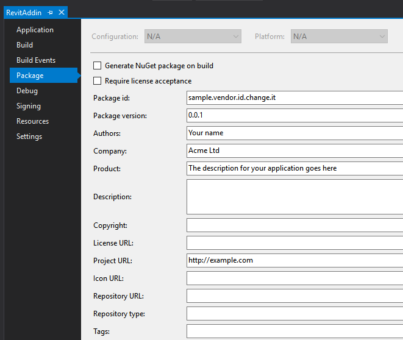
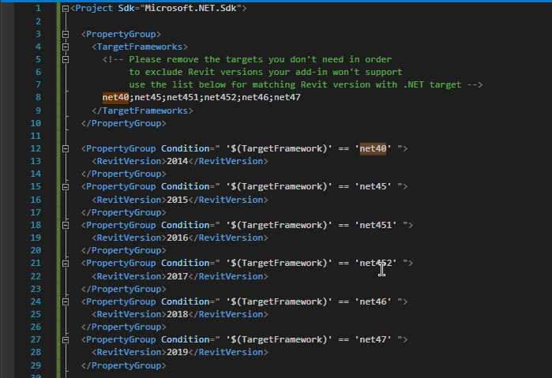

Visual Studio Revit Add-in Template 
===================================

Visual Studio C# (project) template for easy [Revit](https://en.wikipedia.org/wiki/Autodesk_Revit) add-in creation.

## Installation & Update

Just download the latest release (.zip file) from [here](https://github.com/Equipple/vs-templates-revit-addin/releases) and copy it into your `path\to\Visual Studio 2017\templates` folder.

Usually it's `"%USERPROFILE%\Documents\Visual Studio 2017\Templates\ProjectTemplates\Visual C#"`

## Personalization

#### Add-in metadata

Unlike other add-in template this one doesn't require constantly updating .addin file. It takes all the information from project properties:

#### Revit versions

By default the newly created add-in will target Revit x64 2014-2019, you could target fewer versions by simply removing items from `TargetFrameworks`:

## Debug

For your convenience in `Debug` configuration the add-in will copy its manifest to `%AppData%\Autodesk\Revit\Addins` folder with Assembly tags pointing to your compilation output folder.

Before starting the debugger make sure you have selected the proper Revit version:

If Revit won't start probably you have installed it to a non-default location and you have to modify [launchSettings.json](src/Properties/launchSettings.json) file.

You could also use [launchSettings.json](src/Properties/launchSettings.json) to tweak command line parameters passed to Revit.exe file, e.g. you might want Revit to open a project template / family file for every debug session you start.

## License

This project is licensed under the terms of the [MIT License](LICENSE).

## Credits

This template has been inspired by both [Jeremy Tammik](https://github.com/jeremytammik)'s [project templates](https://github.com/jeremytammik/VisualStudioRevitAddinWizard) and [Sander Obdeijn](https://github.com/sanderobdeijn)'s [blog post](http://buildingknowledge.eu/custom-msbuild-targets-for-compiling-addins-for-multiple-revit-versions/) about multi-targeteting different versions of Revit from one project.